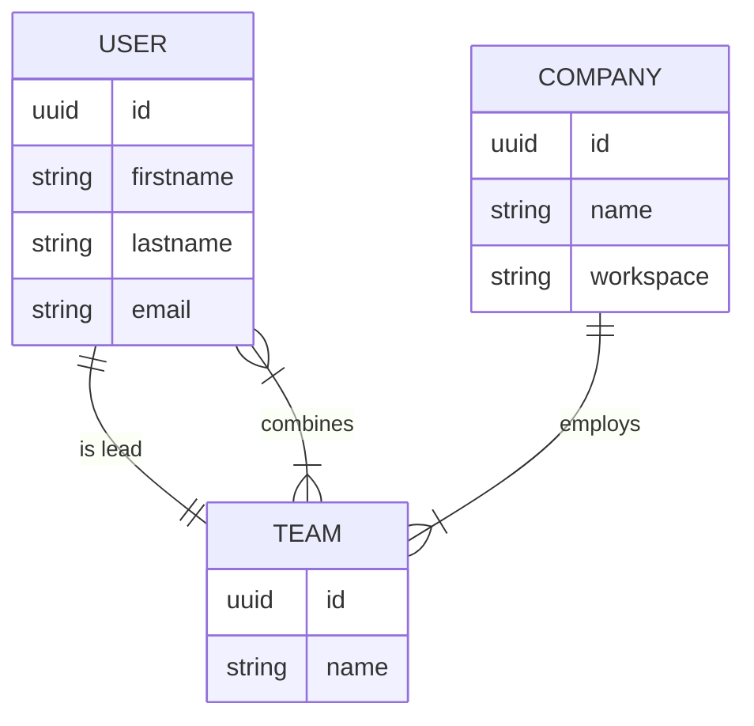

# Using mermaidJs to Draw Database Schemas

Today, I want to share some insights from the start of a new project where I needed to come up with a nice schema for my database. For that I jused [mermaidJs](https://mermaid.js.org/syntax/entityRelationshipDiagram.html): it's a powerful tool that enables you to create all kinds of diagrams with markup. One of the areas where it shines is designing and visualizing database schemas.

## Why mermaidJs?

mermaidJs has two key advantages that make it my go-to tool for this task:

1. **Ease of use**: mermaidJs uses a straightforward and intuitive syntax that makes it accessible to developers of all skill levels. Even if you are new to designing database schemas, you can quickly pick up the basics and start creating.

2. **VS Code Extension**: For those who are already working in VSCode, there are a couple of handy extensions, I used [Markdown Preview Mermaid Support](https://marketplace.visualstudio.com/items?itemName=bierner.markdown-mermaid). This allows you to preview your diagrams directly in your editor, streamlining the design process.

## A Simple Schema

Let's take a look at a simple example of a mermaidJs schema. The schema renders automatically if escaping with ` ```mermaid `. This also works in Github, Gitlab etc out of the box!

```
erDiagram
    USER {
        uuid id
        string firstname
        string lastname
        string email
    }

    TEAM }|--|{ USER : "combines"

    USER ||--|| TEAM: "is lead"

    TEAM {
        uuid id
        string name
    }

    COMPANY ||--|{ TEAM: "employs"

    COMPANY {
        uuid id
        string name
        string workspace
    }
```



In this schema, we define three entities: `USER`, `TEAM`, and `COMPANY`. Each entity has its respective attributes, such as `id`, `firstname`, `lastname`, `email`, `name`, and `workspace`.

The relationships between these entities are defined using different line styles. For example, `}|--|{` represents a many-to-many relationship, `||--||` represents a one-to-one relationship, and `||--|{` signifies a one-to-many relationship.

The `USER` entity, for example, has a many-to-one relationship with `TEAM` (a user can belong to multiple teams), and a one-to-one relationship indicating that a user can be a team lead.

## A Caveat

While mermaidJs is a great tool, it's important to note one potential drawback:

You'll need to manually keep the mermaidJs schema consistent with your python models. This can be a bit time-consuming, but it is a small price to pay for the convenience when implementing the model. And you will thank yourself 2 months down the line when you return to your project!

## TLDR

mermaidJs is a fantastic tool for quickly and easily drawing up database schemas. Use one of the VSCode extensions to render it in the Markdown preview. If you manually keep your diagrams consistent with your implementation you will have a great time especially for less frequently touched projects.
